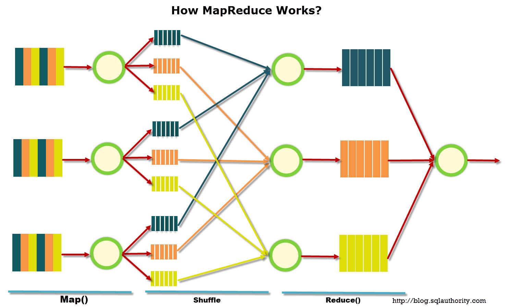

## Map-Reduce

MapReduce is a programming model and an associated implementation for processing and generating large data sets with a parallel, distributed algorithm on a cluster.



A MapReduce program is composed of a `Map()` procedure that performs filtering and sorting (such as sorting students by first name into queues, one queue for each name) and a `Reduce()` procedure that performs a summary operation (such as counting the number of students in each queue, yielding name frequencies). The "MapReduce System" (also called "infrastructure" or "framework") orchestrates by marshalling the distributed servers, running the various tasks in parallel, managing all communications and data transfers between the various parts of the system, and providing for redundancy and fault tolerance.

These two operations bear some resemblance to the Python built-in functions of
that name (which Python itself borrowed from the world of functional
programming); imagine how one might split across several servers the tasks of
summing the squares of many integers:
```python
>>> squares = map(lambda n: n*n, range(11))
>>> squares
[0, 1, 4, 9, 16, 25, 36, 49, 64, 81, 100]
>>> import operator
>>> reduce(operator.add, squares)
385
```
The mapping operation should be prepared to run once on some particular slice
of the overall problem or data set, and to produce a tally, table, or response that
summarizes its findings for that slice of the input.
The reduce operation is then exposed to the outputs of the mapping functions, to
combine them together into an ever-accumulating answer. To use the mapreduce
cluster’s power effectively, frameworks are not content to simply run the
reduce function on one node once all of the dozens or hundreds of active
machines have finished the mapping stage. Instead, the reduce function is run in
parallel on many nodes at once, each considering the output of a handful of map
operations, and then these intermediate results are combined again and again in a
tree of computations until a final reduce step produces output for the whole input.

In conclusion, the map-reduce pattern provides a cloud-style framework for distributed computation
across many processors and, potentially, across many parts of a large data set.

