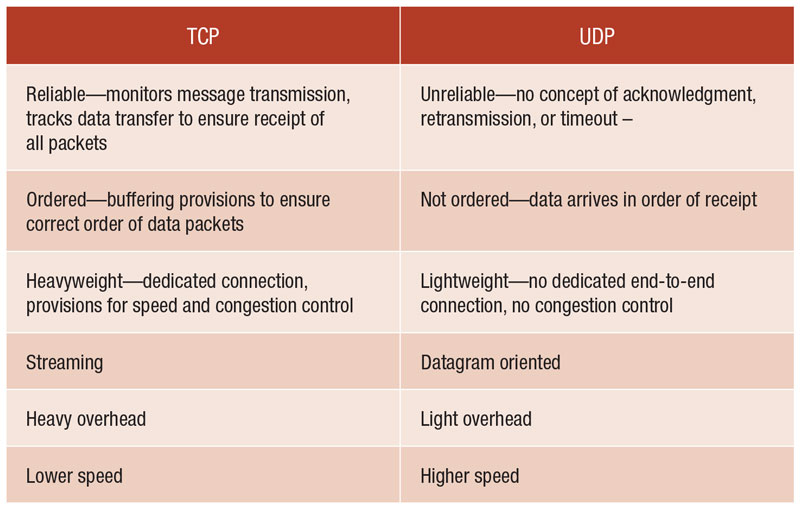

# UDP and TCP
---
The two principal approaches when building a top IP are: UPD and TCP.
- The vast majority of applications today are built atop TCP, the Transmission
Control Protocol, which offers ordered and reliable data streams between IP
applications.
-  A few protocols, usually with short, self-contained requests and responses, and
simple clients that will not be annoyed if a request gets lost and they have to
repeat it, choose UDP, the User Datagram Protocol.

This two methods are described in depth along this chapter, but for now have take a quick look to the differences between this two.

