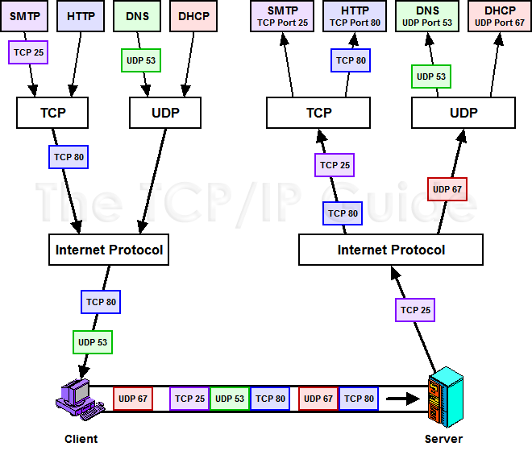

## Addresses and port numbers

We are going to review a bit about this two topics:

The IP protocol  assigns an IP address—which traditionally takes the
form of a four-octet code, like 18.9.22.69—to every machine connected to an IP network. In fact, it does
a bit more than this: a machine with several network cards connected to the network will typically have a
different IP address for each card, so that other hosts can choose the network over which you want to
contact the machine.
But even if an IP-connected machine has only one network card,it also has at least
one other network address: the address 127.0.0.1 is how machines can connect to themselves. It serves
as a stable name that each machine has for itself, that stays the same as network cables are plugged and
unplugged and as wireless signals come and go.
And these IP addresses allow millions of different machines, using all sorts of different network
hardware, to pass packets to each other over the fabric of an IP network.

But with UDP and TCP we now take a big step, and stop thinking about the routing needs of the
network as a whole and start considering the needs of specific applications that are running on a
particular machine. And the first thing we notice is that a single computer today can have many dozens
of programs running on it at any given time—and many of these will want to use the network at the same
moment. You might be checking e-mail with Thunderbird while a web page is downloading in Google
Chrome, or installing a Python package with pip over the network while checking the status of a remote
server with SSH. Somehow, all of those different and simultaneous conversations need to take place
without interfering with each other. This problem is known as need for multiplexing: the need for a single channel to be shared unambiguously by
several different conversations.

You also should remember that when a program on your computer sends or receives data over the Internet it sends that data to an ip address and a specific port on the remote computer, and receives the data on a usually random port on its own computer. If it uses the TCP protocol to send and receive the data then it will connect and bind itself to a TCP port. If it uses the UDP protocol to send and receive data, it will use a UDP port.
